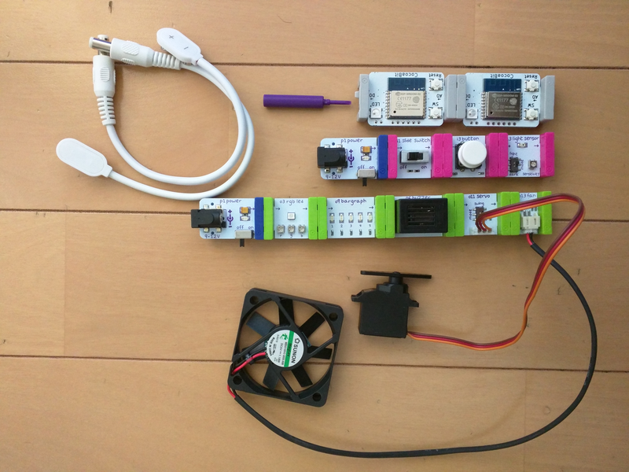

# littleBits/MESH×スマート家電ワークショップ（新年会）参加者資料

Sony CSL 大和田

## 開始まで少々お待ちください

+ チーム分けは決めさせていただいていますので、受付でお問い合わせください。
+ なるべく初対面の方とお隣になっていただくようお願いいたします。
+ 名札にPostitなどでお名前を書いた紙を入れ、首から下げてください。
+ 時間があれば、作りたいものについて紙に書くなどしてイメージを膨らませてください。
+ 本資料は　http://bit.ly/2km7zAA　から公開されていますので、リンクをたどりたい方はブラウザで開いてください。
+ 写真撮影・ビデオ録画がNGな方は、あらかじめスタッフにお伝えください。

## ご挨拶

このたびは新年ワークショップにお越しいただきありがとうございます。
この会の趣旨は、楽しくお酒を飲みつつ、電子ブロック×スマート家電と戯れながら企業間・参加者間の交流をはかることです。

また、簡単なものでいいのですがブロックと家電を利用して作品をお作りいただきたいと思います。お作りいただいたものは５万人来場者が見込まれている2/15-17の東京ビッグサイトイベント「[ENEX2017](http://www.low-cf.jp/)」において、神奈川工科大学のブースにて展示出来る限り展示されます。ぜひお酒の勢いで面白いものをお願いします！

制作物は[Knowledge Connector](http://idea.linkdata.org/all)に記録していただくつもりだったのですが、具体的にイベント計画を立ててみたところ予想外に時間が少なかったので、制作物はスタッフが動画（15秒程度を想定）を撮影させていただきます。一発ネタ歓迎ですので、気軽に作って撮影⇒分解⇒また作るという感じになったらなーと思っております。運用方法は作品制作の時に説明します。

大まかな流れとしては、以下のようになります。

① 飲みながら電子ブロックのワークショップ
② 飲みながら電子ブロック作品制作＆記録
③ 飲みながら発表会

※ 受付で飲み物を取り忘れた方や飲み干した方は合間に取りに行ってください。なくなったらまた買うのでガンガン行ってください。
※ 運営スタッフも飲酒しますので、途中で不測の事態が起こってもご容赦ください。  

## 提供ブロックの確認

テーブルの上には、littleBitsとMESHがそれぞれ１セットづつ置かれているはずです。まずその内容をご確認ください。littleBitsは次の写真のようなまとまり＋電池二個になっています。全部あるか、図のようにつなげて確認してみてください。個数の関係上、テーブルによっては紫の一番右のセンサーが、マイクになっているところもあります。

littleBitsは大阪電気通信大学の魚井宏高教授の私物になります。ご厚意でお貸しいただきました。
最後に個数を確認しますので、なくさないようお願いいたします。

MESHは７タグセットが各テーブルにあります。

## ① 飲みながら電子ブロックのワークショップ

本イベントでの提供システムは、基本的に家電操作や、家電の変更通知を電子ブロックで行えるようにするというものです。家電としては、エアコンと照明と電動ブラインドをご提供する予定です。もしかしたらエコキュートのコントローラもあるかもしれません。

#### MESH
[SonyのMESH](http://meshprj.com/jp/)というすごく面白い電子ブロックがあります。今回はこれで家電を動かしていただきます。
[公式ドキュメントはこちらです](http://support.meshprj.com/hc/ja/articles/211940358-MESH%E3%81%AE%E5%88%9D%E6%9C%9F%E8%A8%AD%E5%AE%9A%E3%82%84%E4%BD%BF%E3%81%84%E6%96%B9%E3%81%8C%E3%82%8F%E3%81%8B%E3%82%8A%E3%81%BE%E3%81%9B%E3%82%93-%E8%AA%AC%E6%98%8E%E6%9B%B8%E3%81%AF%E3%81%82%E3%82%8A%E3%81%BE%E3%81%99%E3%81%8B-)。

スマホ用のMESHのアプリの中で、ソフトウェアタグというものを用いて家電の操作を可能にします。

技術的なところが気になる方は[Qiitaの記事](http://qiita.com/sgrowd/items/6a3e8576be49760db5eb)をご覧ください。イベントではセットアップ済みのソフトウェアタグをMESH SDKアカウント共有にてお使いいただきます。
アカウント情報は、ブロックが乗っている皿の上のポストイットに書いてあります：

#### littleBits
[littleBits](http://jp.littlebits.com/)というすごく面白い電子ブロックがあります。今回はこれに、@wamisnetさんが試作されている[CocoaBit](http://qiita.com/wamisnet/items/9bff0d8c4542d905e325)というESP8266搭載のWiFiブロックを追加して家電を動かしていただきます。ソフトウェアの操作は不要です。

技術的なところが気になる方は[Qiitaの記事](http://qiita.com/sgrowd/items/9ef56370a49f4f10c96c)をご覧ください。イベントではKadecotのほうの設定も済ませた状態で手を動かしていただきます。

#### StrawBees

ブロックではありませんが、[Strawbees](https://strawbees.com/)というすごく面白いキットがあります。

今回はStrawbeesを輸入・販売されているデジタルハイクの浅川さんのご厚意で、多数Strawbeesをご提供いただきました。これと電子ブロックを組み合わせると、いろいろとおもしろいものが作れると思います。作例がありますので、ちょっと作ってみましょう！

https://photos.google.com/share/AF1QipPQ6jH88hcutY1e-c8j1rK_xgbfEuYHoYyM-gtrWmaTnVGN01YBCupimm8m-l0dpQ?key=VEdDSlZfaWgyNHhZMTNuNHh4U25hRE9NUzVCVWJn

チュートリアルアプリのようなものもあります。

https://itunes.apple.com/jp/app/strawbees-become-an-inventor/id1037694735?mt=8

さて、ここまでが前提知識になります。

## ② 飲みながら電子ブロック作品制作＆記録

次に家電とブロックを組み合わせて、酒の勢いで面白いものを制作していただきます。
作品は、スタッフのスマートフォンで撮影させていただきます。15秒程度を想定していますので、気にせずガンガンネタを作ってお呼びいただければと思います。記録したら分解し、次の制作に入っていただけたら嬉しいです。

ワークショップ成果をこのように集めるというのは私も初めての経験ですので、もしうまく回らなかったらごめんなさい。

littleBitsの追加をご希望の場合は、スタッフを呼んでください。ポストイットにお名前と持ち出すブロックの名前を書き、ケースに貼っていただきます。忘れず返却をお願いします。

#### 宿題のおさらい
まずイベント募集時のお願いとして、ブロックと組み合わせてみたいものをお持ちいただいていると思いますので、そのアイデアを紙に書いてみてください。

#### グループでのアイデア共有
持ち寄ったアイデアを、グループで共有します。一人一分で発表し、グループ内で共有してください。

#### 制作物の決定・制作
自分でお持ちいただいたアイデアでも構いませんし、チームで考えた新しいアイデアでも構いません。ブロックで遊びながら、１時間ほどでなるべくたくさんの作品を作ってみてください。

作品が完成したら、スタッフをお呼びいただき、動画撮影です。

なお、littleBitsの種類は、あらかじめテーブルに置いてあるものだけではありません。
[http://jp.littlebits.com/bits/](http://jp.littlebits.com/bits/)

魚井先生のlittleBitsコレクションにはほとんど揃っていますので、上記のHPからご所望のbitを決めたうえで、追加する場合には私まで問い合わせてください。（個数管理のためです）

#### ブロックの回収

次の発表会に進む前に、お使いいただいたブロックを回収します。なくなっていないかのご確認もお願いします。

## ③ 飲みながら発表会

発表会は、撮影した動画を見ながら、お作りになった方に内容のご説明を頂きます。
発表時間は一作品30秒程度でお願いします。1分以上はNGです。ただし何作品発表しても結構です。

後日、展示に向けてお問い合わせをする可能性がありますので、自己紹介をはっきりとお願いします（ビデオで録画しています）。お名前はなるべく名札と一致させてください。

## 解散

これで終わりです。残ったお酒・おつまみはご希望の方に差し上げます。

## 実施体制

主催　株式会社ソニーコンピュータサイエンス研究所
　　　神奈川工科大学 HEMS認証支援センター
協力　一般財団法人 省エネルギーセンター（ENEX主催社）
　　　JTBコミュニケーションデザイン（SEJ主催社）
　　　Linked Open Data チャレンジ Japan 実行委員会
　　　おうちハック同好会
　　　Sony MESH Team
　　　大阪電気通信大学 デジタルゲーム学科 魚井宏高教授

